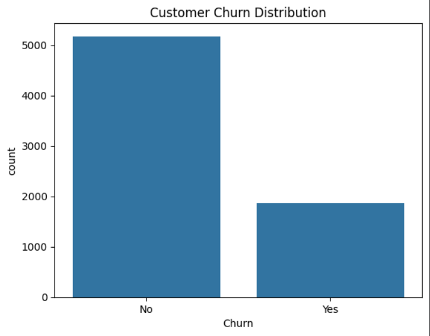
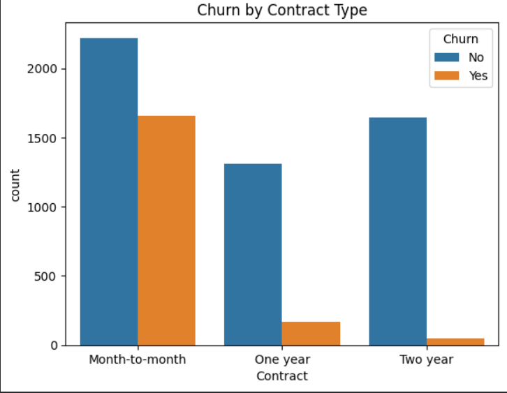
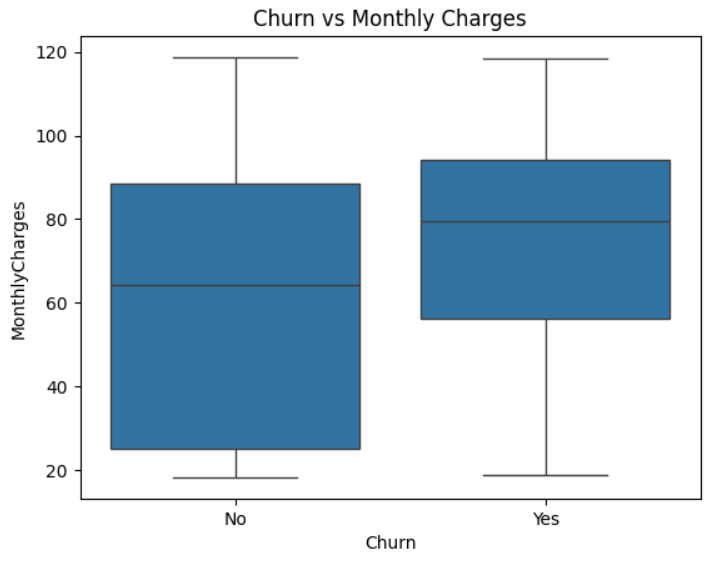
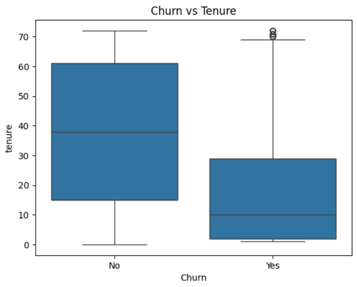

# Customer Churn Prediction

🚀 A machine learning project to predict customer churn and analyze key factors affecting customer retention using Python.

📉 Customer Churn Analysis (Python)

## 📌 Project Overview
This project predicts customer churn using machine learning and identifies key factors that influence customer retention.

## 🎯 Objectives
* Predict whether a customer will churn
* Identify key drivers of churn
* Help businesses improve customer retention

## 🛠 Tools & Technologies
* Python
* Pandas, NumPy
* Matplotlib, Seaborn
* Scikit-learn

## 📊 Key Insights
* Achieved 81% accuracy using Logistic Regression
* Customers with longer tenure are less likely to churn
* Contract type significantly impacts churn behavior

## 💡 Business Interpretation

* Customers on month-to-month contracts are more likely to churn  
* Higher monthly charges increase churn probability  
* Customers with low tenure are at higher risk of leaving  

## 🖼 Output Preview  

### 📊 Churn Distribution  

### 📄 Churn by Contract Type  

### 💰 Churn vs Monthly Charges  

### ⏳ Churn vs Tenure  

## 🤖 Model Used
* Logistic Regression
* Accuracy: 81%

## 🚀 Project Workflow
* Data cleaning and preprocessing
* Exploratory Data Analysis (EDA)
* Feature selection
* Model building (Logistic Regression)
* Model evaluation

## 📁 Dataset
* Telco Customer Churn Dataset (7000 records)

## 📌 Outcome
Provided actionable insights that can help businesses reduce churn and improve customer retention strategies.

📂 Files in Repository
*.ipynb → Jupyter Notebook
* Dataset file
* Model code

## 🔗 Project File
See the notebook above for full analysis.
